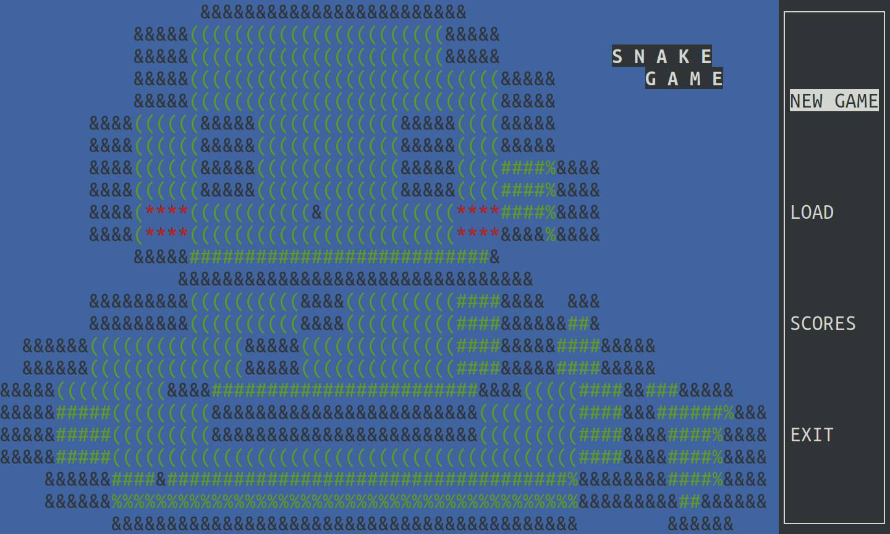
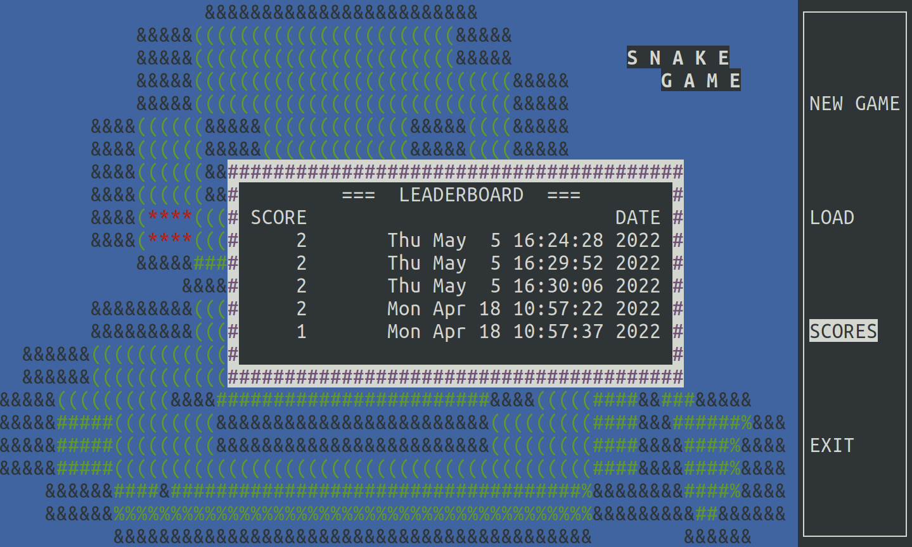
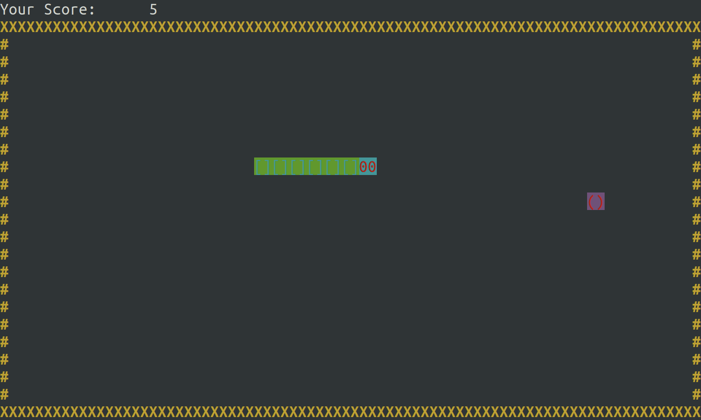
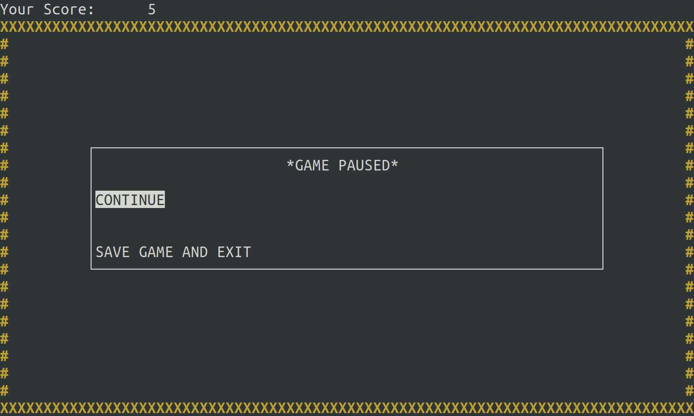

# Snake Game
## Team members
- Lai, Pok Hang
- Lo, Ian Leong Ting

## Introduction
- Snake game based on C++
- Group Project of ENGG1340





## Games Rules
- Keys:
    - Arrow / WASD: Menu bar navigation, snake movement control
    - Enter: Select menu option
    - Spacebar: Pause
- Snake should move only inside the yellow border and search for food (red apple).
- Once the food was eaten, the snake body grows one unit in length.
- Game ends if the snake crashes with itself or to the wall.
- Try to control the snake to eat as many apples as possible!

## Game Elements
1. Generation of random game sets or events
    - The apples are generated at random (uniformly distributed) around the map.
    - mt19937 pseudo-random generator is used.
2. Data structures for storing game status
    - Class `Snake`, will store all the properties of the current snake.
    - Class `SaveAndLoad`, for save and load methods.
3. Dynamic memory management
    - `new` operator is used to allocate memory on the free store for `Snake` and `SaveAndLoad` objects.
    - `delete` operator is called to restore the memory allocated when the game ends.
4. File input/output
    - The pause menu provides the option to save current game status.
    - At start menu, the saved game can be loaded from the `log.txt` file, and continue to play.
    - After the game ends, the score will be recorded in the `leaderboard.txt` file.
    - Files are saved under `log` directory.
5. Program codes in multiple files
    - `./include` contains header files
    - `./src` contains source files
    - `./log` contains files for saving and loading game status

## Compilation and Execution Instructions
### How to Build
- Run the following commands in the project root directory
- Install ncurses library and compile the project 
    - `make all`
- Run the game
    -  `./main`
### Note
- `make ncurses` will automatically run upon `make all`, it will clone the `ncurses` library under the project directory (`./ncurses`), and install it under your home directory (`~/ncurses_files`). Make sure that no non-empty colliding directories exist. 
- The clone, install and compile process takes around 1-2 minutes when running `make all` the first time.
- `make clean` can remove object files and executable.
- Fully built and tested on HKU `academy11` server.

## External Library
- `ncurses`

## Project Structure
```
    .
    ├── Makefile
    ├── README.md
    ├── demo
    │   ├── demo_1.png
    │   ├── demo_2.png
    │   ├── demo_3.png
    │   └── demo_4.png
    ├── get_curses.sh
    ├── include
    │   ├── new_game.hpp
    │   ├── pause_menu.hpp
    │   ├── save_and_load.hpp
    │   ├── snake.hpp
    │   ├── start_menu.hpp
    │   └── visuals.hpp
    ├── log
    │   ├── leaderboard.txt
    │   └── state.txt
    ├── main.cpp
    ├── ncurses
    └── src
        ├── new_game.cpp
        ├── pause_menu.cpp
        ├── save_and_load.cpp
        ├── snake.cpp
        ├── start_menu.cpp
        └── visuals.cpp
```
